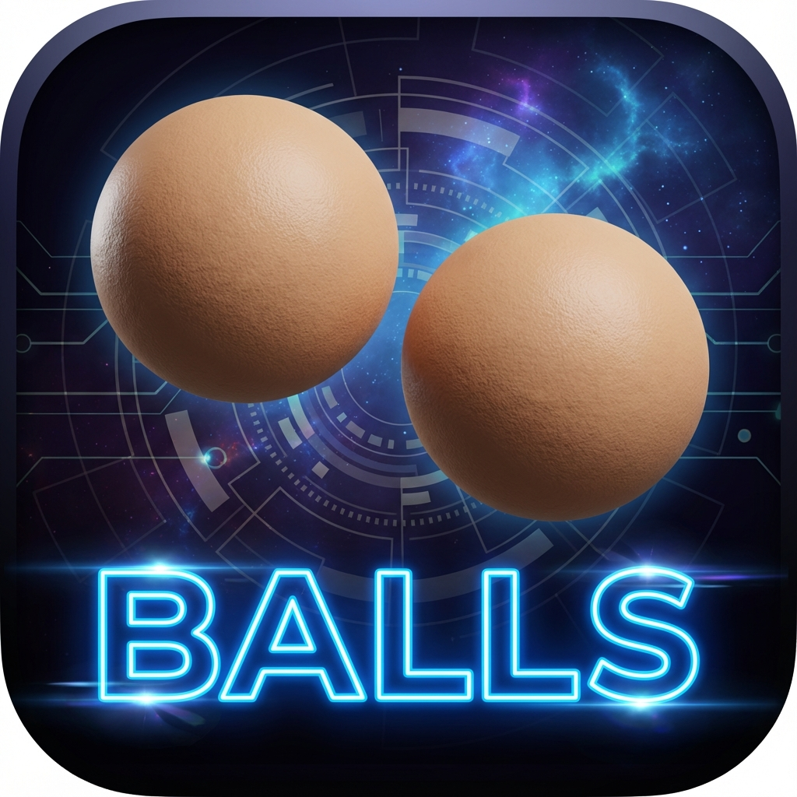

# BALLS Launcher

**The Ultimate Gamery Launcher for Linux**



BALLS is a high-performance, C-based game launcher built with Raylib. It features a modern grid interface, procedural sound effects, and seamless Steam integration.

## Features

- **Steam Integration**: Automatically detects and displays your installed Steam games.
- **System Apps**: Launches standard Linux applications.
- **Modern UI**: Smooth vertical scrolling, hover effects, and keyboard navigation.
- **Procedural Audio**: Real-time generated sound effects for a futuristic feel.
- **Customization**:
    - **Edit Any App**: Rename apps or change their icons (auto-resized).
    - **Search**: Fast real-time filtering.
    - **Optimized**: Written in pure C for maximum performance.

## Installation

### Prerequisites
- `gcc`
- `cmake`
- `make`
- `raylib` (Optional, cmake can often handle dependencies, but having it installed is recommended)

### One-Step Install
Run the included TUI installer:

```bash
sudo ./install.sh
```

This will:
1. Compile the project.
2. Install the binary to `/usr/local/bin/balls`.
3. Install the icon to `/usr/share/pixmaps`.
4. Create a desktop entry in your application menu.

## Manual Build

```bash
mkdir build && cd build
cmake ..
make
./balls
```

## Usage

- **Launch**: Click a card or press Enter when searching.
- **Edit**: Hover over a card and click **EDIT**.
- **Scroll**: Use mouse wheel.
- **Switch Categories**: Click "GAMES" (Steam) or "APPS" (System) in the sidebar.

## License
MIT
